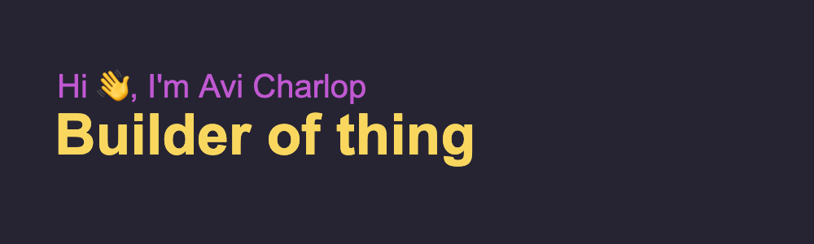

**Hi, aviously I'm Avi.**

Senior full-stack engineer and team lead. Ten years of shipping, remote since 2017. When I'm not coding I love motorcycles, running, and my kids. That list is sorted by speed, not importance.

The banner says "builder of thing." Singular. It started as a typo. I kept it, because one thing at a time is honestly the whole philosophy.

I play the long game: products that are still running in five years, teams that own what they ship, and code the next engineer can read without a support group. I'm a fully-formed AI-assisted human, which means I use the robots a lot and I'm still the one accountable when it breaks.

## Three things I'd tell you about at a party (if you asked, which you did, thank you)

**[WhoCards](https://whocards.cc)** · conversation cards for people who want to skip "so, what do you do?" I co-founded it and I'm the only engineer, so the Astro + Stripe storefront, the fulfillment automation across two shipping providers, and the iOS app in 14 languages (right-to-left included) are all my fault. ~600 orders shipped. Android is in closed testing, a phrase I have now been saying for a while.

**[Closer](https://closer.earth)** · the platform behind regenerative co-living communities. I built the "one-click village": a whole community platform provisioned across six cloud providers from a single typed config. Setup went from a day to 12 minutes. A half-built village is a real, resumable state in the system, not an error somebody cleans up by hand at 11pm.

**[Vionlabs](https://vionlabs.com)** · hired and led a 4-engineer team that built a greenfield enterprise media portal while the old one stayed live and paying. 1.5M titles, 10M+ tags, searchable in milliseconds. We shipped something new before each of 4 trade shows and turned booth feedback into same-day releases. Turns out sales people are excellent product managers if you actually listen to them.

More detail, case studies, and the resume live at [aviously.me](https://aviously.me).

## Things I believe, stated bluntly

- Boring infrastructure is a compliment.
- Types, tests, and CI are how you are kind to future strangers.
- Mentoring beats heroics. Heroics don't scale, they just look good on a Tuesday.

## Open source

- [prism-rails](https://github.com/acharlop/prism-rails) · maintainer. 250K+ downloads, mostly by people who have never heard of me, which is the best kind.
- [JsSIP](https://github.com/versatica/JsSIP/pull/629) · in-band DTMF support and a mutation fix, across 3 merged PRs.
- [create-t3-app](https://github.com/t3-oss/create-t3-app/pull/2038) · improved the generated database start script.
- [bidi-js](https://github.com/lojjic/bidi-js/pull/15) · hand-maintained TypeScript types for the factory and its API.
- [tailwind-config-viewer](https://github.com/rogden/tailwind-config-viewer/pull/57) · added the font-family viewer.

## I'm curious about you

What are you building? What's the duct-tape part of it that only one person knows how to fix? I ask everyone this, and I mean it.

Email is best: [avicharlop@gmail.com](mailto:avicharlop@gmail.com) · [aviously.me](https://aviously.me) · [LinkedIn](https://linkedin.com/in/acharlop)

Available for selective opportunities. "Selective" means interesting people and a worthwhile technical challenge.

<details>
<summary>What I've actually been typing lately (WakaTime, updates nightly)</summary>

<!--START_SECTION:waka-->

```txt
Total Time: 6 hrs 4 mins

Markdown     2 hrs 1 min           ███████▒░░░░░░░░░░░░░░░░░   29.74 %
TypeScript   1 hr 19 mins          █████░░░░░░░░░░░░░░░░░░░░   19.37 %
CSS          1 hr 7 mins           ████░░░░░░░░░░░░░░░░░░░░░   16.49 %
Other        44 mins               ██▓░░░░░░░░░░░░░░░░░░░░░░   10.83 %
HTML         41 mins               ██▓░░░░░░░░░░░░░░░░░░░░░░   10.03 %
```

<!--END_SECTION:waka-->

</details>

<picture>
  <source media="(prefers-color-scheme: dark)" srcset="https://raw.githubusercontent.com/acharlop/acharlop/output/github-contribution-grid-snake-dark.svg">
  <source media="(prefers-color-scheme: light)" srcset="https://raw.githubusercontent.com/acharlop/acharlop/output/github-contribution-grid-snake.svg">
  
</picture>

<sub>The snake eats my commits. We have an understanding.</sub>
